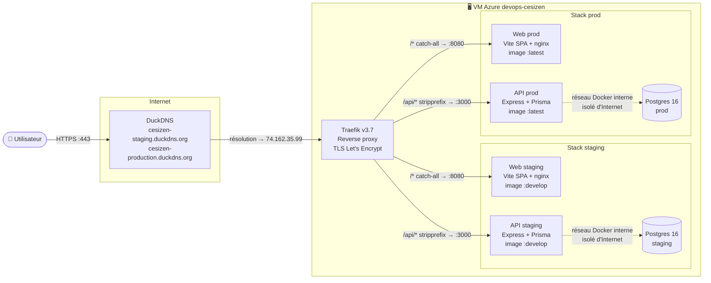

# Architecture applicative — CESIZen

Vue **runtime** : comment une requête utilisateur traverse le système, et quels composants applicatifs vivent où.

## Schéma

## Points clés à expliquer en soutenance

### 1. Un seul reverse proxy pour 2 stacks

Traefik est partagé entre staging et prod. Le routing se fait sur le **hostname** :
- `cesizen-staging.duckdns.org` → containers staging
- `cesizen-production.duckdns.org` → containers prod

### 2. Routing par chemin sur chaque stack

Pour un même domaine, Traefik route par **path prefix** :
- `/api/*` → strippé, redirigé vers le container API (port 3000)
- Tout le reste → SPA Vite servie en statique par nginx (port 8080)

Conséquence côté front : `VITE_API_URL=/api` baked dans le build → axios fait `GET /api/articles`, Traefik strip `/api` et envoie `GET /articles` à l'API.

### 3. Isolation réseau de la base

Chaque DB est sur un **réseau Docker `internal: true`** : pas de route vers Internet, pas de port exposé. Seul l'API du même stack peut la joindre par son hostname Docker (`db`).

Conséquence : si demain quelqu'un compromet Traefik, il ne peut PAS atteindre la DB directement. Defense-in-depth.

### 4. HTTPS de bout en bout via Let's Encrypt

Traefik utilise le challenge **TLS-ALPN-01** sur le port 443 (pas besoin d'ouvrir des ports supplémentaires). Renouvellement automatique 30j avant expiration.

### 5. Stateful = DB uniquement

Web et API sont **stateless** : tuer un container et le recréer ne perd rien. Toutes les données vivent dans le **volume Postgres** (montage `cesizen-db-data:/var/lib/postgresql/data` par stack). C'est ce qui rend le redéploiement par Watchtower safe.
