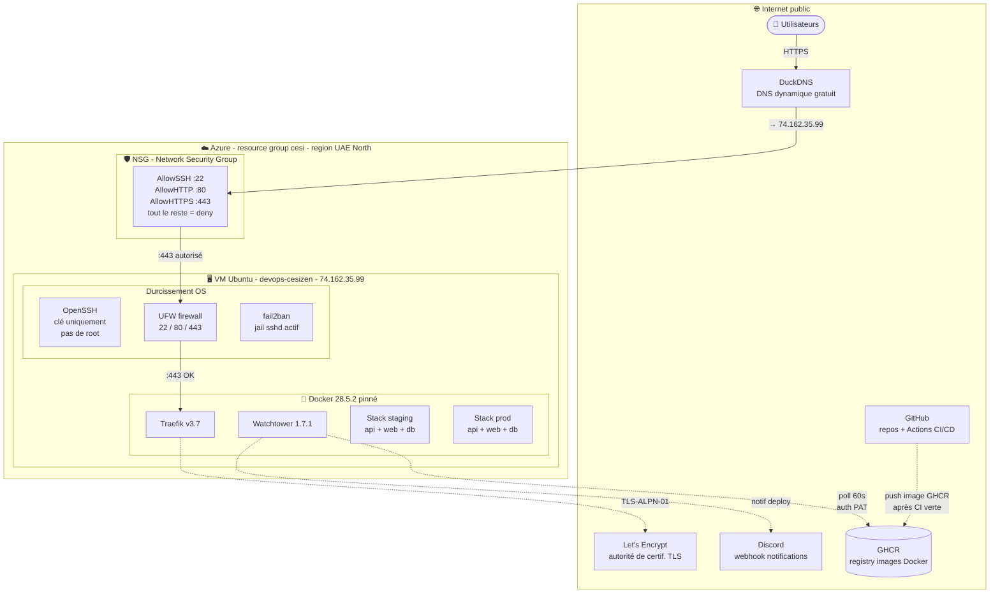

# Architecture infrastructure & sécurité — CESIZen

Vue **infrastructure** : où tournent les composants, comment ils sont sécurisés, et quels services externes ils utilisent.

## Schéma



## Points clés à expliquer en soutenance

### 1. Defense-in-depth : 3 couches de filtrage réseau

```
Internet → NSG Azure → UFW (firewall OS) → Docker (containers)
```

Chaque couche peut refuser un paquet. Pour qu'une attaque atteigne un container, il faut traverser les 3. Et la DB n'est même pas exposée au niveau Docker (réseau `internal: true`).

### 2. SSH durci dès le bootstrap

```bash
# /etc/ssh/sshd_config.d/99-cesizen-hardening.conf
PasswordAuthentication no
PermitRootLogin no
```

Combiné avec fail2ban (jail `sshd`), une tentative brute-force est bannie après quelques échecs. Le user `azureuser` n'a accès qu'avec sa clé SSH personnelle.

### 3. Pas de push depuis la CI (CD pull-based)

Volontairement, **GitHub Actions n'a aucun accès à la VM**. Pas de clé SSH dans les secrets CI, pas d'IP allowlist. À la place :

- CI push **l'image** sur GHCR
- Watchtower (sur la VM, en local) **pull** quand il voit une nouvelle image

Avantage : si demain on me vole mes tokens GitHub, l'attaquant ne peut **pas accéder à ma VM**. Voir [retours anciennes promos] qui pointent du doigt l'action Appleboy comme vecteur d'attaque non recommandé.

### 4. GHCR images privées + PAT

Les images Docker poussées sur GHCR sont **privées** (pas publiques par défaut). Watchtower s'authentifie via un **Personal Access Token** (scope minimal `read:packages`) stocké dans `/root/.docker/config.json`. Aucune image n'est exposée à des inconnus.

### 5. Docker version verrouillée

```bash
apt-mark hold docker-ce docker-ce-cli
```

Suite à l'incident Docker 29 (cassait Traefik et Watchtower via une dépréciation API), Docker est figé en 28.5.2 sur la VM. Toute mise à jour est volontaire, pas accidentelle via `apt upgrade`.

### 6. DuckDNS = compromis pratique

DuckDNS est un service gratuit qui donne 5 sous-domaines `*.duckdns.org`. Pour un projet école, c'est suffisant et ça démontre la configuration HTTPS sans coût. Pour un vrai projet, on prendrait un domaine acheté (~10€/an).

### 7. Email Let's Encrypt configuré

L'email `nicolas.descarp@outlook.fr` est enregistré chez Let's Encrypt : ils enverront un mail si un certificat est sur le point d'expirer (renouvellement raté). Filet de sécurité supplémentaire.
