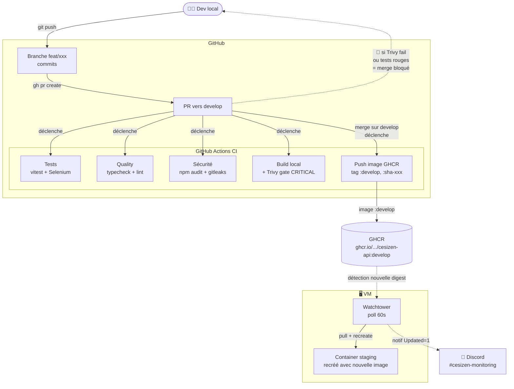
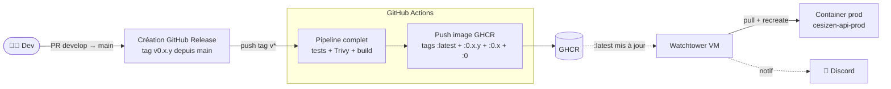

# Cycle CI/CD — CESIZen

Vue **pipeline** : du commit local jusqu'au container redémarré en prod, avec toutes les étapes de qualité et de sécurité intermédiaires.

## Schéma — pipeline d'une feature (staging)

## Schéma — release prod (par tag git)

## Points clés à expliquer en soutenance

### 1. Branch protection = aucun raccourci possible

Sur `develop` et `main` :
- Push direct interdit (même pour l'admin de l'org)
- PR obligatoire
- Tous les checks doivent être verts (tests, typecheck, audit, gitleaks, lint, build, e2e, Trivy gate)
- Pas de bypass

Conséquence : **il est techniquement impossible** d'envoyer du code non testé ou avec vulnérabilité CRITICAL en staging/prod.

### 2. Trivy = sécurité shift-left

Le scan tourne **AVANT le push GHCR** (build local d'abord, scan, push seulement si OK) :
- Sur PR : scan tourne, image jamais poussée → bloque le merge si vuln corrigeable trouvée
- Sur push develop/main/tag : scan tourne + push si OK → bloque l'arrivée d'image vulnérable sur GHCR

→ Aucune image vulnérable ne peut atteindre la production.

### 3. CD pull-based = isolation forte

Aucune connexion entrante depuis l'extérieur vers la VM (sauf 80/443 pour les users). C'est la VM elle-même (Watchtower) qui va chercher les nouvelles images sur GHCR.

→ Si demain la CI est compromise, l'attaquant ne peut pas pivoter vers la VM.

### 4. Tags séparés staging vs prod

| Branche / Tag | Image GHCR | Container concerné | Quand |
|---|---|---|---|
| Merge sur `develop` | `:develop`, `:sha-xxx` | `cesizen-api-staging` | À chaque merge |
| Tag git `vX.Y.Z` sur main | `:latest`, `:X.Y.Z`, `:X.Y`, `:X`, `:sha-xxx` | `cesizen-api-prod` | À chaque release explicite |

Watchtower est configuré pour ne mettre à jour que les containers labellisés `com.centurylinklabs.watchtower.enable=true` et n'utilise pas la même image entre staging et prod.

### 5. Cycle de vie d'un ticket aligné sur les transitions GitHub

Voir [ticket-lifecycle.md](./ticket-lifecycle.md) — chaque transition du ticket (`In Progress → PR → Merged → Deployed`) correspond à une étape concrète de ce pipeline. Le ticket bouge **avec** le code, pas en parallèle.

### 6. Observabilité minimale via Discord

Chaque update Watchtower (succès ou échec) génère une notification Discord. C'est volontairement minimal : ça couvre 90 % des cas d'intérêt d'un projet de cette taille (« qu'est-ce qui a été déployé, à quelle heure ? »).

Pour un projet plus large, on ajouterait Loki+Grafana (logs centralisés) et Prometheus (métriques) — voir « Veille techno » pour la justification de ce non-choix.

## Outils du pipeline

| Étape | Outil | Pourquoi celui-là |
|---|---|---|
| Versioning | Git + GitHub | Standard du marché, intégration native Actions |
| CI | GitHub Actions | Hébergé, gratuit pour repos publics, free tier généreux |
| Tests unitaires API | Vitest | Compatible ESM, plus rapide que Jest |
| Tests E2E web | Selenium WebDriver | Demandé explicitement par le programme bloc 3 |
| Audit deps | `npm audit --audit-level=critical` | Natif npm, zéro setup |
| Détection secrets | gitleaks | Scan historique git complet (pas juste le diff) |
| Scan image | Trivy | Standard, plus rapide que Snyk en mode CI |
| Registry | GHCR | Intégré GitHub, auth natif, gratuit pour images privées |
| CD | Watchtower | Pull-based, simple, pas besoin de SSH depuis la CI |
| Notif deploy | Watchtower + shoutrrr + Discord | Aucune infra additionnelle, intégré natif |
