# Cycle de vie d'un ticket — CESIZen

Document de référence pour la gestion projet du bloc CDA. Le cycle est appliqué à tous les tickets du board [CESIZen — Cycle de vie tickets](https://github.com/orgs/Nicolas-s-Organization/projects/1).

## Schéma global

```mermaid
flowchart LR
    classDef pmStage fill:#e8eaf6,stroke:#3f51b5,color:#1a237e
    classDef devStage fill:#fff8e1,stroke:#f9a825,color:#e65100
    classDef ciStage fill:#e8f5e9,stroke:#43a047,color:#1b5e20

    B[Backlog]:::pmStage
    T[Todo]:::pmStage
    IP[In Progress]:::devStage
    PR[PR ouverte]:::devStage
    M[Merged]:::ciStage
    D[Deployed]:::ciStage

    B -->|priorisation| T
    T -->|dev pick up| IP
    IP -->|push + PR| PR
    PR -->|CI verte + review| M
    M -->|Watchtower auto-pull| D
```

## Détail des étapes

| Étape | Qui fait l'action | Déclencheur | Sortie attendue |
|---|---|---|---|
| **Backlog** | PO / dev | Création d'une issue depuis le template | Issue typée `feat:` ou `bug:` avec contexte rempli |
| **Todo** | PO / dev | Priorisation lors du planning (peut être implicite en solo) | Ticket prêt à être pris, critères d'acceptation clairs |
| **In Progress** | Développeur | Création d'une branche `<type>/<slug>` depuis `develop` | Commits réguliers sur la branche |
| **PR ouverte** | Développeur | `gh pr create` ou bouton GitHub | Description PR liée au ticket (`closes #XX`), CI déclenchée |
| **Merged** | Reviewer + auteur | Tous les checks verts + branch protection respectée + review approuvée | Commit de merge sur `develop` (ou `main` pour release) |
| **Deployed** | Watchtower (auto) | Image GHCR mise à jour suite au merge | Container redémarré sur la VM avec la nouvelle image, smoke test OK |

## Plan de test (recette)

Chaque ticket de type `feat:` doit contenir une section **« Plan de test »** dans son template. Cette section liste les étapes pas-à-pas pour que le demandeur (PO, jury, soi-même dans 6 mois) puisse valider que la fonctionnalité fonctionne, sans connaissance du code.

Exemple (extrait du ticket *seed BDD*) :

> 1. `docker compose down -v && docker compose up -d --build`
> 2. `psql ... SELECT email FROM users` → 2 lignes
> 3. `docker compose restart api` → seed re-tourne, mais count en base inchangé

C'est le contenu de ce bloc qui sert de **critère d'acceptation factuel** au moment de la review et qui rend la démo soutenance reproductible.

## Branch protection — garde-fou du cycle

Le passage `PR ouverte` → `Merged` est techniquement bloqué par les rulesets GitHub sur `develop` et `main` :

- Push direct sur la branche : interdit
- PR obligatoire
- Status checks requis (CI verte) : `test`, `typecheck`, `audit`, `gitleaks`, `build-push` (back) + `lint`, `build`, `e2e`, `build-push` (front)
- Pas de bypass possible (pas même pour l'admin de l'org)

Conséquence : aucune transition ne peut sauter une étape. Le cycle est appliqué par l'outillage, pas seulement par la discipline.

## Déploiement automatique — pull-based

`Merged` → `Deployed` est entièrement automatisé par **Watchtower** (poll GHCR toutes les 60s). Pas d'action humaine, pas de SSH depuis la CI. Voir [README infra](../README.md) pour les détails du compose.

## Pour la soutenance

Une slide reprend ce schéma Mermaid (rendu en image PNG via [mermaid.live](https://mermaid.live/) ou un export VS Code). La démo live consiste à montrer un ticket existant en `Todo`, le faire passer à `In Progress` → ouvrir une PR → merger → observer Watchtower déployer en direct → drag du ticket sur `Deployed` côté board.
